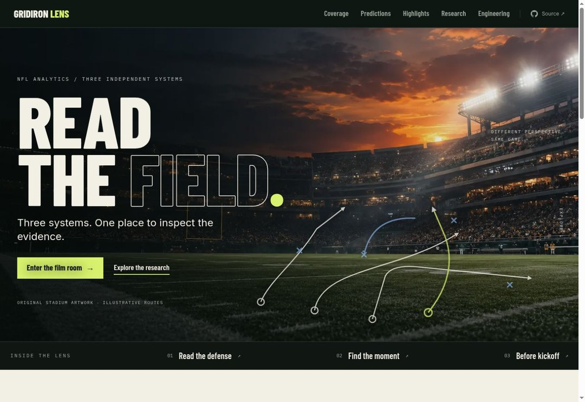
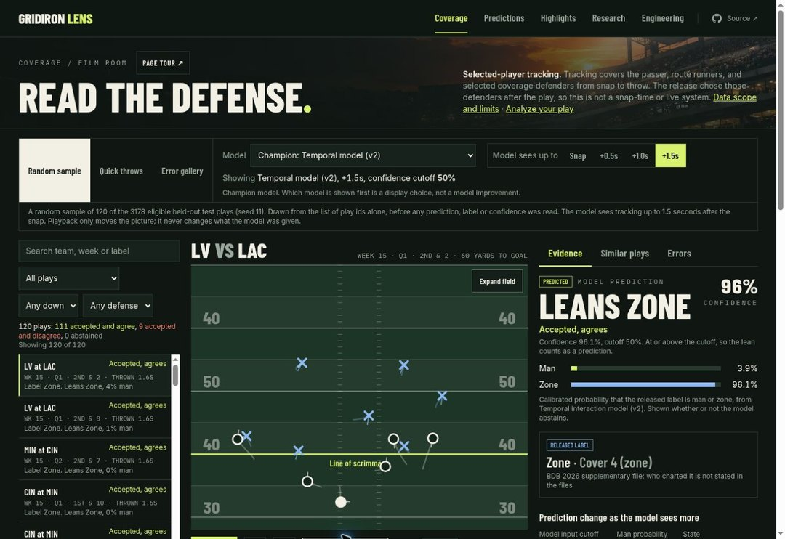
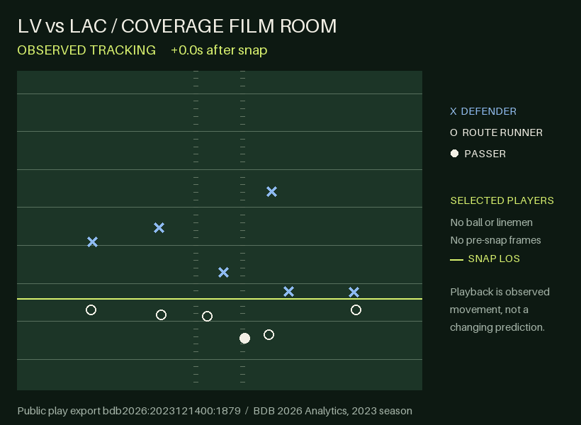
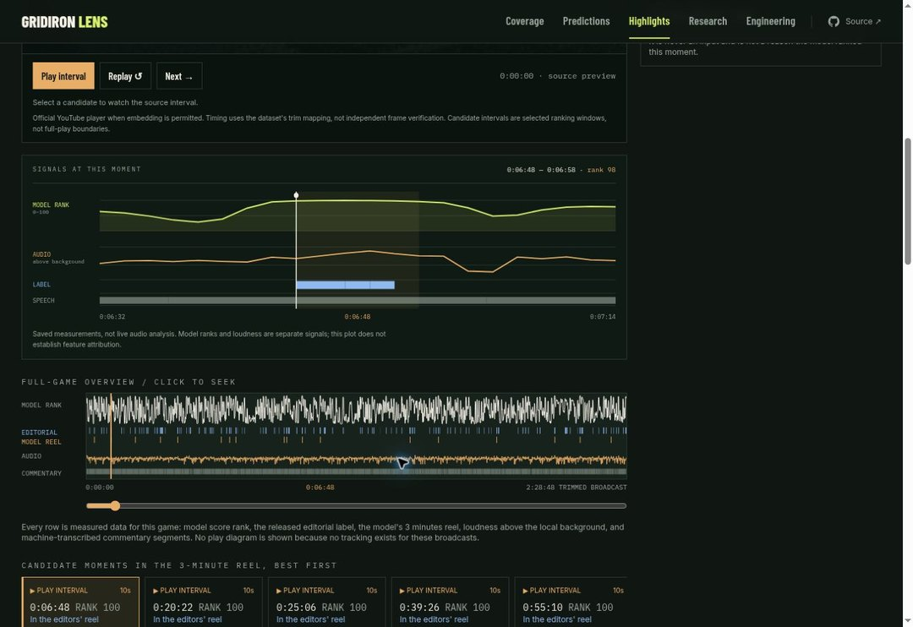
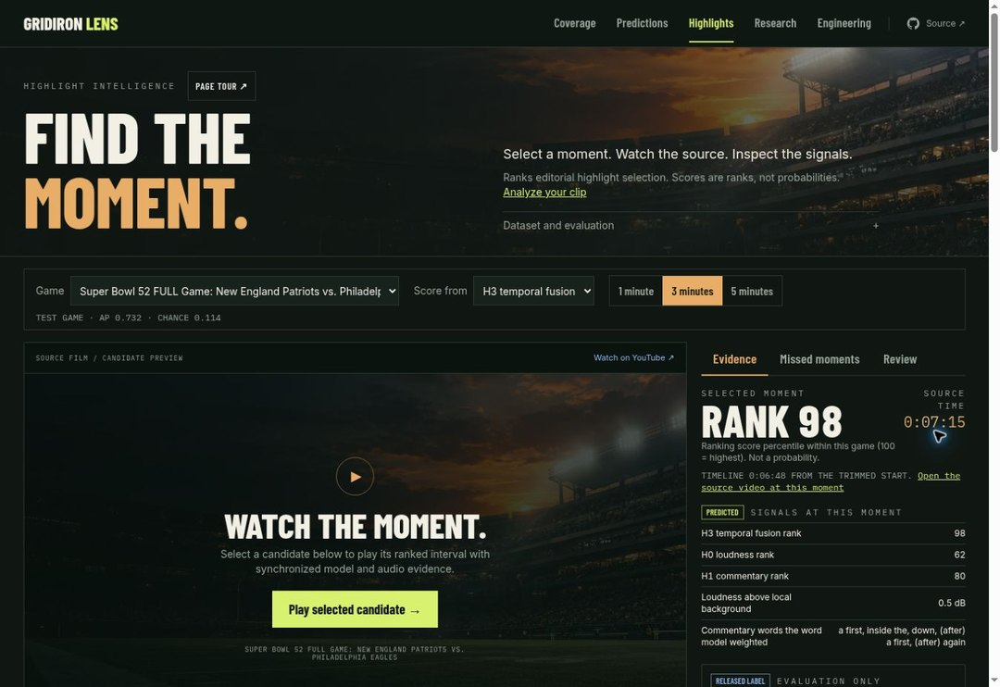
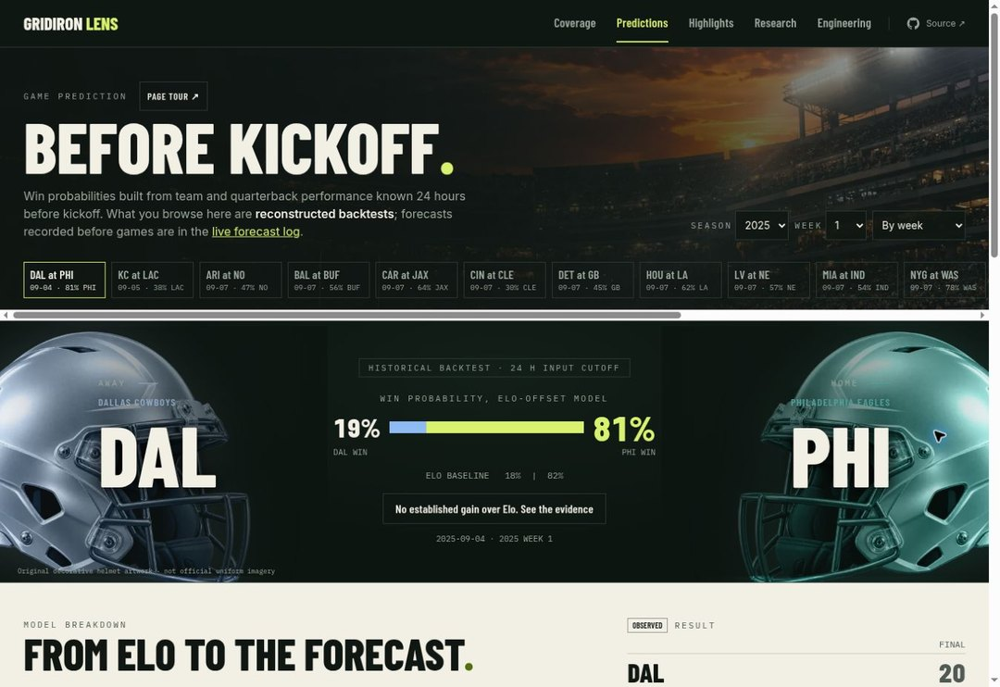
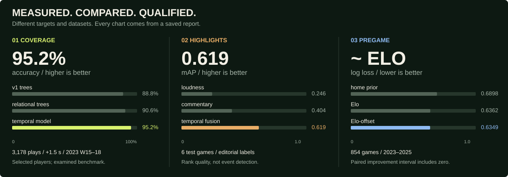
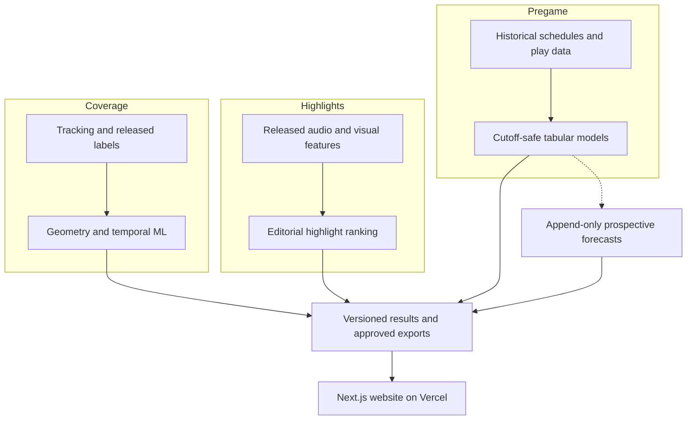

<div align="center">

# Gridiron Lens

**Read the defense. Find the moment. See the game before kickoff.**

One NFL analytics website. Three independently built ML systems. Evidence you can explore.

[](https://github.com/Harvard2016/nfl-analytics-platform/actions/workflows/ci.yml)


### [Open the live website ↗](https://nfl-analytics-platform-theta.vercel.app/)

[Coverage film room](https://nfl-analytics-platform-theta.vercel.app/coverage?model=v2_temporal) · [Highlight timeline](https://nfl-analytics-platform-theta.vercel.app/highlights) · [Pregame predictions](https://nfl-analytics-platform-theta.vercel.app/predictions) · [Research](https://nfl-analytics-platform-theta.vercel.app/research)

<a href="https://nfl-analytics-platform-theta.vercel.app/">
  
</a>


</div>

## Take the two-minute tour

| Start here | Try this | What you will see |
|---|---|---|
| **[01 / Coverage](https://nfl-analytics-platform-theta.vercel.app/coverage?model=v2_temporal)** | Play a snap, switch the input cutoff, inspect a defender | Observed trajectories, saved predictions, released labels, uncertainty and model sensitivity |
| **[02 / Highlights](https://nfl-analytics-platform-theta.vercel.app/highlights)** | Select a candidate and inspect its timeline | Ranked moments, audio, speech, editorial labels and a timestamped source link |
| **[03 / Predictions](https://nfl-analytics-platform-theta.vercel.app/predictions)** | Choose a matchup, then open performance | Win probabilities, feature contributions, calibration and an Elo comparison |
| **[04 / Research](https://nfl-analytics-platform-theta.vercel.app/research/experiments)** | Open an experiment | The data, split, settings, commit, result and limitations behind the headline |

Each main module has a first-visit tour and a **“How was this calculated?”** section. The public website reads saved exports; it does not train models or process uploaded files.

## 01 / Coverage Intelligence

**A film room built around observed player movement and a temporal man/zone model.**

<a href="https://nfl-analytics-platform-theta.vercel.app/coverage?model=v2_temporal">
  
</a>

[](https://nfl-analytics-platform-theta.vercel.app/coverage?model=v2_temporal)

*Playback rendered from an approved public tracking export. It shows observed positions, not broadcast video or live inference.*

- Compare the preserved tree baseline, relational trees, logistic regression and temporal model.
- Change what the model saw: snap, +0.5 s, +1.0 s or +1.5 s. Playback and model input are separate controls.
- Inspect player pairings, similar plays, team tendencies and the error gallery.
- See calibrated probabilities, abstention and sensitivity explanations alongside the released label.

**Under the hood:** normalized player coordinates → defender–receiver pair features → masked pooling → a two-layer GRU → per-cutoff calibration. Three chronological development folds select the model; weeks 13–14 set calibration and policies.

**Scope matters:** the source covers selected pass-coverage players from snap to throw. Defenders were selected by the release after the play. No pre-snap frames, ball, linemen or rushers exist in this input. This is not full-field or live video coverage recognition.

[Explore](https://nfl-analytics-platform-theta.vercel.app/coverage?model=v2_temporal) · [Evaluation](https://nfl-analytics-platform-theta.vercel.app/coverage/evaluation?model=v2_temporal) · [Errors](https://nfl-analytics-platform-theta.vercel.app/coverage/errors?model=v2_temporal) · [Model card](docs/model_cards/coverage_temporal_v2.md) · [Code](src/gridiron_lens/coverage/)

## 02 / Highlight Intelligence

**A full-game ranking timeline that lets you inspect why a moment was selected.**

<a href="https://nfl-analytics-platform-theta.vercel.app/highlights">
  
</a>

- Browse the 40-game NFL feature benchmark and compare loudness, commentary, embedding and temporal models.
- Inspect a candidate's rank, audio signal, speech and editorial agreement on one timeline.
- Change the reel budget, review missed moments and inspect candidate boundaries.
- Open the official YouTube source at the mapped time; the player works when the owner permits embedding.

**Under the hood:** released CLIP, SlowFast and PANN embeddings + loudness → training-only transforms → temporal fusion → ranking → a strict-budget reel decoder.

**What the score means:** agreement with editorial highlight selection, not a probability or an event label. It does not yet detect touchdowns or interceptions. The trained benchmark ranker cannot score newly uploaded video until matching feature extractors are verified. Local uploads currently use a loudness baseline or experimental speech mode.

<details>
<summary>See the source viewer and candidate evidence</summary>



NFL footage is not hosted by this repository. Embedding may be disabled by the video owner; a timestamped source link remains available. A selected interval is a ranking window, not a verified full-play boundary.

</details>

[Explore](https://nfl-analytics-platform-theta.vercel.app/highlights) · [Local upload lab](https://nfl-analytics-platform-theta.vercel.app/highlights/analyze) · [Model card](docs/model_cards/highlights_h3_bundle_v3.md) · [Extractor limits](docs/HIGHLIGHT_EXTRACTORS.md) · [Code](src/gridiron_lens/highlights/)

## 03 / Game Prediction

**Pregame probabilities with a clear time cutoff and a baseline that is allowed to win.**

<a href="https://nfl-analytics-platform-theta.vercel.app/predictions">
  
</a>

- Select a historical game and inspect the saved win probability and feature contributions.
- Compare models by log loss, Brier score and calibration across seasons.
- Separate reconstructed historical backtests from timestamped prospective forecasts.
- Inspect the 24-hour cutoff, source hashes and late-record policy.

**Under the hood:** nflverse history → rolling team/QB features with cutoff checks → Elo, Elo-offset logistic and margin comparisons → probabilities → calibration and walk-forward evaluation.

**The result is honest:** there is no established gain over Elo on the previously examined 2023–2025 benchmark. The live forecast log records predictions before games; only eligible records are scored. It is not a betting product.

[Explore](https://nfl-analytics-platform-theta.vercel.app/predictions) · [Performance](https://nfl-analytics-platform-theta.vercel.app/predictions/performance) · [Forecast log](https://nfl-analytics-platform-theta.vercel.app/predictions/forecasts) · [Model card](docs/model_cards/pregame_forecast_v3.md) · [Code](src/gridiron_lens/pregame/)

## Results, with their limits attached



| System | Saved result | What the number actually measures |
|---|---|---|
| Coverage, primary temporal model at +1.5 s | **95.2% accuracy**, **90.0% man recall**, log loss **0.128** | Agreement with released labels on 3,178 plays, 2023 weeks 15–18. Previously examined benchmark, selected-player input |
| Coverage, one registered 2024 look | **139/142 correct**; **31/34 man plays recalled** | Three games only. 95% play-level Wilson interval 94.0–99.3%; does not account for plays sharing a game. Same selected-player source |
| H3 highlight ranking | **0.619 mAP**, random **0.088** | Editorial agreement across six previously examined test games. Strict 3-minute reel: 78.0% precision, 19.3% of labelled highlight time covered |
| Elo-offset game prediction | Log loss **0.6349**, Elo **0.6362** | 854 games in 2023–2025. Paired difference interval includes zero; no established gain |

V3 attention pooling, robustness training, hierarchy, highlight fusion and opponent-adjusted ratings remain documented experiments. **No V3 candidate replaced a shipped model.** Negative results are part of the research.

The graphic is regenerated from committed reports with `python scripts/build_readme_assets.py`. The [results map](reports/README.md) points to the numerical records, intervals and protocols.

## One product, three separate systems



The modules share game/play/team identifiers, run-record formats, path helpers and UI components. They do **not** share features, fitted models or evaluation targets. The game predictor never reads coverage or highlight outputs. An optional local FastAPI service handles tracking and clip uploads; it is separate from the deployed website.

| Layer | Built with |
|---|---|
| Website | Next.js 16, React 19, TypeScript, CSS/Tailwind, custom SVG field and signal visualizations |
| Models and features | Python, PyTorch, scikit-learn, NumPy, Polars, pandas |
| Local data | Parquet, DuckDB, filesystem manifests; SQLite for upload jobs |
| Local media | ffmpeg/ffprobe, optional whisper.cpp |
| Reproducibility | uv and npm lockfiles; JSON runs with commits, seeds, hashes, splits and metrics |
| Delivery and checks | Vercel, GitHub Actions, pytest, Ruff, ESLint and Playwright |

No cloud GPU, central experiment server or microservice fleet is needed to browse the product.

## Run the website in a fresh clone

**Node.js 24. No dataset, trained model or account required.**

```sh
git clone https://github.com/Harvard2016/nfl-analytics-platform.git
cd nfl-analytics-platform/apps/web
npm ci
npm run dev
```

Open `http://localhost:3000`. For Python research, local uploads, model prerequisites and forecast commands, use the [getting-started guide](docs/GETTING_STARTED.md).

## Find your way around the repository

| Location | What belongs here |
|---|---|
| [`apps/web/`](apps/web/README.md) | Website, shared UI components and frozen public exports |
| [`src/gridiron_lens/`](src/gridiron_lens/) | Independent `coverage/`, `pregame/`, `highlights/`; `shared/`, local `service/`, research `videocov/` |
| [`data/`](data/README.md) | Source catalog and frozen manifests; raw and derived bulk data are ignored |
| [`reports/`](reports/README.md) | Preserved benchmarks, experiments, run records and append-only forecasts |
| [`docs/`](docs/README.md) | Model cards, methods, registered plans, audits and curated visual assets |
| [`tests/`](tests/) | Pipeline, leakage, timing, privacy and parity checks |
| [`bin/`](bin/) | Module CLIs and the local inference launcher |
| [`scripts/`](scripts/) | Repository publication checks and README graphic generation |
| [`ops/`](ops/) | Optional local forecast scheduling templates |

The [data catalog](data/catalog.json) separates source downloads, cleaned data, features, source snapshots, model files, uploaded media and approved exports. Existing frozen paths are preserved.

## Research you can inspect

| Evidence | Read it |
|---|---|
| Coverage architecture, calibration and limits | [Model card](docs/model_cards/coverage_temporal_v2.md) |
| A fresh 2024 sample, registered before scoring | [Protocol](docs/experiments/coverage_fresh_2024.md) · [Report](reports/v3/coverage_fresh_2024.json) |
| Why new-video scoring is unfinished | [H3 card](docs/model_cards/highlights_h3_bundle_v3.md) · [Extractor investigation](docs/HIGHLIGHT_EXTRACTORS.md) |
| Pregame source timing and append-only forecasts | [Model card](docs/model_cards/pregame_forecast_v3.md) |
| Experiments that helped, failed or remain blocked | [V3 status](docs/V3_EXECUTION_STATUS.md) · [Run records on the website](https://nfl-analytics-platform-theta.vercel.app/research/experiments) |
| Original stadium and helmet artwork | [Asset provenance](docs/ASSETS.md) |
| Why the README and folders look this way | [Popular-repository research](docs/README_RESEARCH.md) |

## Data, privacy and security

Raw datasets, private media, full transcripts, uploads, trained weights and credentials stay out of Git. Public tracking samples and derived results have source-specific display limits in [the rights manifest](data/manifests/rights.json). A dataset license does not grant NFL broadcast rights.

The optional upload service is **local only**, uses per-job access tokens and rejects foreign browser origins and non-loopback hosts. It is not deployed behind the public website. Clips begin unreviewed; edits clear human-review confirmation.

[Security policy](SECURITY.md) · [Public repository audit](docs/audits/public_repository_2026-10-06.md) · [Contribution guide](CONTRIBUTING.md)

**Code licensing:** this repository currently has no open-source license grant. Public visibility does not license the code or third-party data; an owner-selected code license can be added separately. Not affiliated with the NFL.

---

**[Visit Gridiron Lens ↗](https://nfl-analytics-platform-theta.vercel.app/)** — start with the temporal coverage film room, inspect an error, then compare the evidence across the other two systems.
