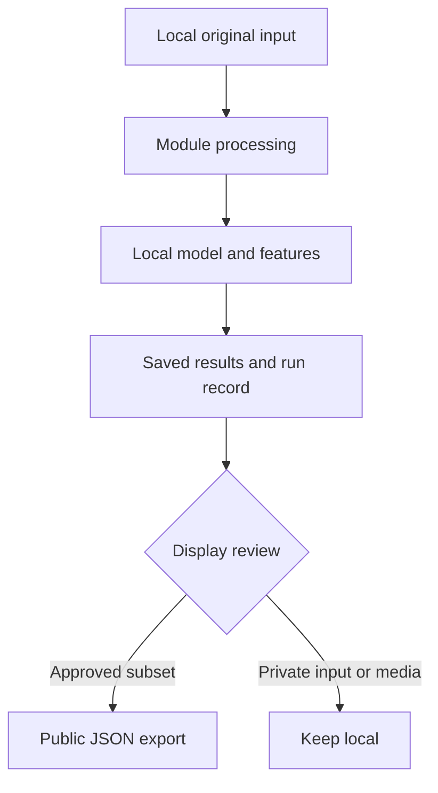

# Data map

You can run the website without downloading anything. Research data, trained models and uploaded media stay on the machine doing the work.

Use [catalog.json](catalog.json) to find a source and its expected path. Use [manifests/rights.json](manifests/rights.json) to decide what may be displayed. The catalog is a guide; it does not grant data or broadcast rights.

| Layer | Folder | Purpose | In Git? |
|---|---|---|---|
| Original inputs | `raw/<source>/` | Downloads kept unchanged | No |
| Cleaned data | `processed/<module>/` | Normalized tracking and cleaned tables | No |
| Model inputs | `features/<module>/` | Feature tables and temporal tensors | No |
| Frozen source copies | `snapshots/nflverse/<id>/` | Independent copies with hashes and fetch times | No |
| Authorized media | `local_media/` | Owner-supplied video or audio | No |
| Upload jobs | `jobs/<job-id>/` | Private uploads, cuts and results; SQLite job index | No |
| Source and split metadata | `manifests/` | Audit counts, frozen splits, source mapping and display policy | Yes |

These paths follow the working pipelines; do not move existing data into a new folder scheme without updating those pipelines. `shared/config.py` is the path contract. New experiments should use module and version subfolders within the existing layers.

## Where each download belongs

| Download | Destination | Needed for |
|---|---|---|
| BDB 2026 **Analytics** | `raw/bdb2026/` | Coverage training; tracking and released coverage labels |
| BDB 2026 **Prediction** | `raw/bdb2026_prediction/` | Small 2024 input sample; it has no coverage-label table |
| nflverse | `raw/nflverse/games.csv`, `raw/nflverse/pbp/` | Pregame features and forecasts |
| SVHighlights football subset | `raw/svhighlights/` | Released embeddings, loudness, transcripts and editorial labels |
| Helmet Assignment | `raw/helmet_assignment/` | Local calibration research; not coverage validation |
| A game you have permission to process | `local_media/` | Local clip analysis and review |

For Kaggle sources, obtain the files through your own account after reviewing the rules. Keep `kaggle.json` outside the repository; never put credentials in a public environment variable. Do not extract whole multi-gigabyte archives just to inspect one table.

## From an input to the website

`models/` stores trained files locally. [reports/](../reports/README.md) holds reviewable evidence. `apps/web/public/demo/` holds the intentionally public exports consumed by the site. Anything in the public folder is downloadable, even if no page links to it.

## Before publishing new data

1. Identify the source in the catalog and rights manifest.
2. Keep raw inputs, model binaries, uploads and full transcripts local.
3. Export only the permitted fields and population; do not copy whole source tables.
4. Preserve hashes, cutoff, split and model version in the run record.
5. Run `python scripts/check_repository.py` and the module's export/parity checks.

The automated check blocks common private paths and credential fields. It cannot decide whether a new dataset license permits publication; that review is still required.
